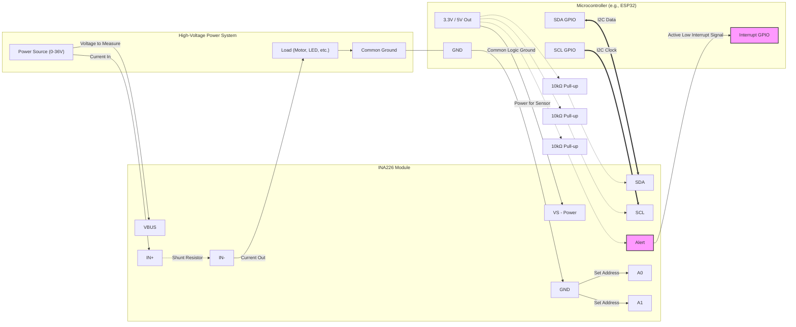

# INA226 & MCU Connection Diagram (Maximizing Features)

To fully utilize all the features of the INA226—specifically to avoid polling the I2C bus and to use hardware interrupts for **Conversion Ready** or **Over-Limit** alarms—you must connect the `Alert` pin to a GPIO interrupt pin on your microcontroller.

Below is a schematic diagram showing the complete wiring for high-side current sensing with hardware interrupt support.

### Key Considerations for Maximizing Features:

1. **The Alert Pin connection (Highlighted in Pink):** 
   This is the critical difference between a basic setup and an advanced setup. By connecting the `Alert` pin to a digital input on your MCU that supports interrupts, you can configure the INA226 `Mask/Enable Register (06h)` to trigger this pin when:
   * A conversion cycle is fully finished (saves I2C bandwidth, no polling needed).
   * Current goes above/below a critical limit (hardware protection).
   * Voltage goes over/under limit.
   * Power goes over limit.
   * *Note: The Alert pin is Open-Drain, meaning it requires a pull-up resistor to the MCU's logic voltage (3.3V). Many breakout boards include this automatically.*

2. **A0 and A1 Addressing:**
   By wiring these to GND, VS, SDA, or SCL, you can set up to 16 different I2C addresses. This allows you to have up to 16 INA226 sensors on the exact same two I2C wires, all maximizing the bus. 

3. **High-Side Sensing:**
   Connecting the sensor on the positive wire (between the Power Source and the Load) is generally preferred because it keeps the Load firmly connected to the system Ground. The INA226 is specifically designed to handle common-mode voltages up to 36V on its `IN+`/`IN-` and `VBUS` pins independently of its logic supply (`VS`).
