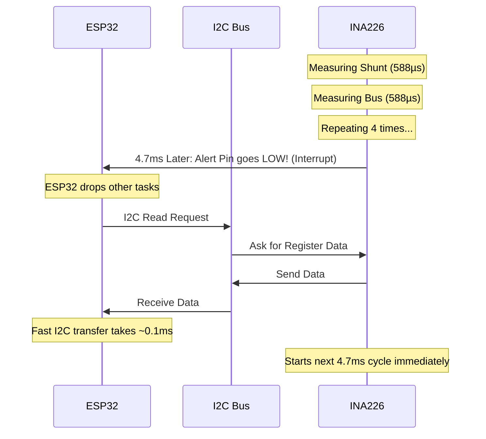

# Understanding I2C Timing vs. INA226 Conversion Timing

To fully understand the system's timing, we need to separate it into two distinct parts: **Internal Sensor Timing** (the INA226 doing its job) and **Communication Timing** (the ESP32 talking to the INA226 via I2C).

## 1. INA226 Internal Timing (Conversion & Averaging)
As discussed earlier, this is the time the INA226 takes to physically measure the analog voltages and average them.

*   **Example from the file:** `(588µs + 588µs) × 4 = 4.704ms`
*   During this 4.7ms, the INA226 is busy sampling the analog signals. 
*   **Crucial Concept:** The INA226 does this entirely on its own in the background. It does not need the ESP32 or the I2C bus to perform these measurements.

## 2. ESP32 I2C Communication Timing
When the ESP32 wants to know the result, it uses the I2C bus to ask the INA226 for the data. I2C has its own speed limit (clock frequency).

*   **Common I2C Speeds on ESP32:**
    *   Standard Mode: 100 kHz (100,000 bits per second)
    *   Fast Mode: 400 kHz (400,000 bits per second) - *Often the default/recommended for INA226*

*   **How long does an I2C read take?**
    To read one 16-bit register (like the Shunt Voltage), the ESP32 sends the INA226 address, the register pointer, and receives 2 bytes back. Including start/stop bits and acknowledgements, this is roughly 40 bits of data transferred.
    *   At **100 kHz**, a read takes roughly **0.4 ms** (400 µs).
    *   At **400 kHz**, a read takes roughly **0.1 ms** (100 µs).

## 3. The Relationship (How they interact)

The I2C speed is completely independent of the INA226 conversion time. The INA226 continuously updates its internal registers every 4.7ms (in our example). The ESP32 drops in via I2C (taking ~0.1ms) to read whatever is currently in that register.

Here is how they relate based on how you write your code:

### Scenario A: Polling too fast (Wasting resources)
If you put your I2C read inside an ESP32 `loop()` without delays, it might execute every 1ms.
*   **0ms:** INA226 starts converting. ESP32 reads via I2C (gets old data).
*   **1ms:** ESP32 reads via I2C (gets same old data).
*   **2ms:** ESP32 reads via I2C (gets same old data).
*   **4.7ms:** INA226 finishes conversion and updates the register with new data.
*   **5ms:** ESP32 reads via I2C (finally gets the new data!).
> [!WARNING]
> Polling faster than the conversion time wastes ESP32 processing power and clogs up the I2C bus, which is problematic if you have multiple sensors.

### Scenario B: Polling too slow (Missing data)
If your ESP32 reads via I2C only once every 20ms:
*   The INA226 will complete about 4 full conversion cycles (at 4.7ms each) before the ESP32 checks it.
*   You are missing the intermediate data points, which might be fine if you don't need high-resolution tracking, but it means you calculated a 4.7ms update rate for no reason.

### Scenario C: The Perfect Match (Using Interrupts)
This is why the **Alert Pin** mentioned in your document is the best approach. 

**Why this is ideal:**
1. The INA226 takes its time (4.7ms) to get a clean, averaged reading.
2. The ESP32 sleeps or does other things (like WiFi) during those 4.7ms.
3. The moment the data is ready, the INA226 signals the ESP32.
4. The ESP32 performs a lightning-fast I2C read (0.1ms) to grab the fresh data. 
5. No CPU time is wasted, and you never read duplicate data.
